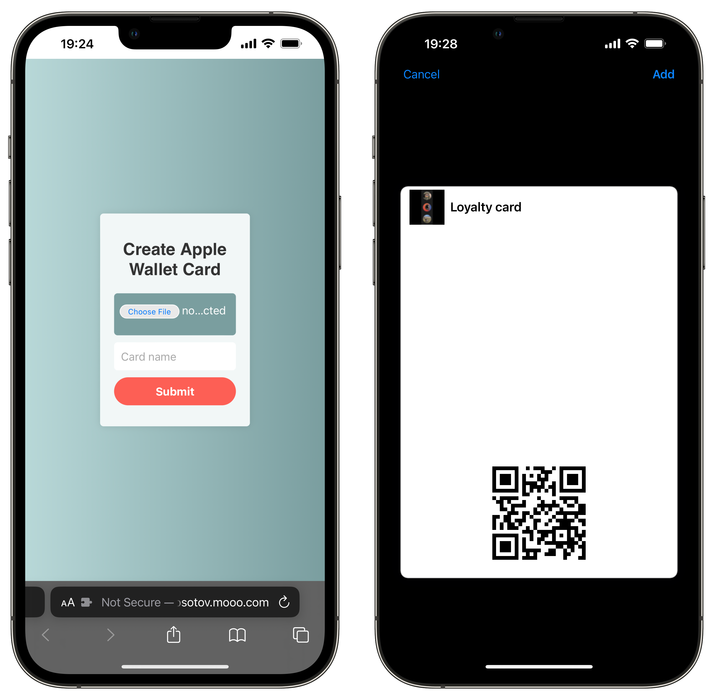

](https://hub.docker.com/r/igooor-bb/inno-espq-smartaccess)](https://img.shields.io/docker/image-size/igooorbb/inno-espq-smartaccess)


# SmartAccess

SmartAccess allows you to easily add and manage all your important QR codes, barcodes, bonus cards, and tickets in one convenient location – your Apple Wallet. With just a few taps, you can access and use these items whenever you need them.

Streamline your digital life and stay organized with SmartAccess.



## Motivation

Rather than having to install multiple apps to store different cards and tickets, or having to search through different apps to find the code or card you need, SmartAccess allows you to centralize everything in one place – your Apple Wallet. This not only saves time and effort, but also helps you stay organized and streamline your digital life.

One of the unique features of SmartAccess is that it works as a web service accessed through a browser, rather than requiring installation. This means you can use SmartAccess to add and manage your cards and tickets from any device with a web browser, without having to install multiple apps on your phone. In addition to providing a single source for all your cards and tickets, SmartAccess also takes care of creating the necessary entities in your Apple Wallet, so you can easily access and use them whenever you need them.

## Getting started

### Installation

You need to [install poetry](https://python-poetry.org/docs/) and then follow these steps to install the dependencies:

```bash
# Use python3.11 project env
poetry env use python3.11

# Install dependencies
poetry install

# Run dev server
poetry run dev
```

### Generate Apple Wallet PassKit keys

You can use [our wiki page](../../wiki/How-to-generate-keys-for-Apple-Wallet-PassKit) to get all the keys you need for Apple Wallet PassKit

### Custom SSL/TLS Certificate and Key Pair for testing

You may want to use a custom SSL/TLS certificate and private key pair rather than a real certificate signed by a certificate authority. Hence, to create a custom SSL/TLS certificate and key pair, you can use the OpenSSL utility and the following command:

```bash
openssl req -x509 -newkey rsa:4096 -keyout ./certs/key_test.pem -out ./certs/certificate_test.pem -sha256 -days 36500
```

This command generates a self-signed certificate and key pair, which is saved to the `./certs` directory as `key_test.pem` and `certificate_test.pem`, respectively.

## Troubleshooting

For macOS users, it may be problematic to install `m2crypto`. Hence, use the following steps:

Install OpenSSL and SWIG:

```
brew install openssl
brew install swig
```

Change SWIG and clang environment variables during `poetry install` so that `m2crypto` will get all OpenSSL requirements:

```
env LDFLAGS="-L$(brew --prefix openssl)/lib" \
CFLAGS="-I$(brew --prefix openssl)/include" \
SWIG_FEATURES="-cpperraswarn -includeall -I$(brew --prefix openssl)/include" \
poetry install
```

At this point `m2crypto` is installed, you can continue to explore the project.

```bash
# Create keys for testing
openssl req -x509 -newkey rsa:4096 -keyout ./certs/key_test.pem -out ./certs/certificate_test.pem -sha256 -days 36500
```
## Contribution

We welcome contributions to SmartAccess! If you have an idea for a new feature or have found a bug, please open an issue or submit a pull request.

To submit a pull request, follow the fork-and-pull workflow:

1. Fork the repository to your personal account
2. Create a new branch and make your changes on that branch
3. Push your changes to your forked repository
4. Submit a pull request from your branch to the upstream repository

We appreciate your help in making SmartAccess the best it can be.

## License

SmartAccess is licensed under the [MIT License](LICENSE). This means that you are free to use, modify, and distribute the software as long as you include the appropriate credit and follow the terms of the license.
